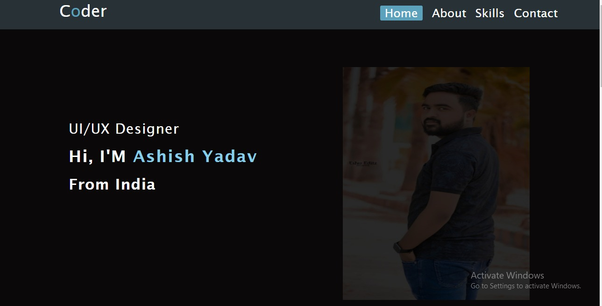
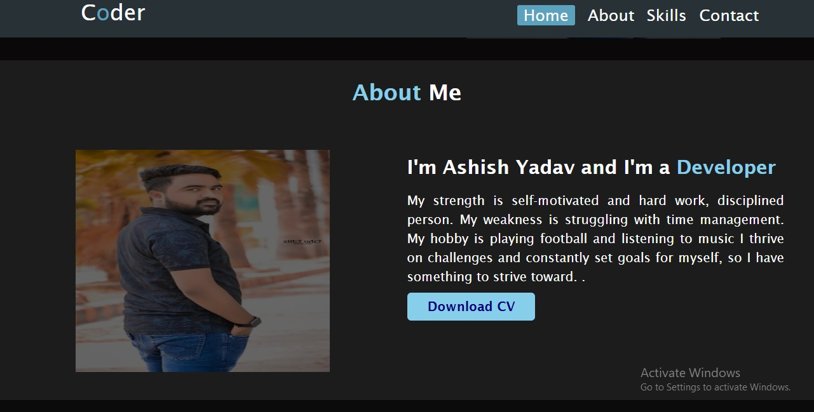
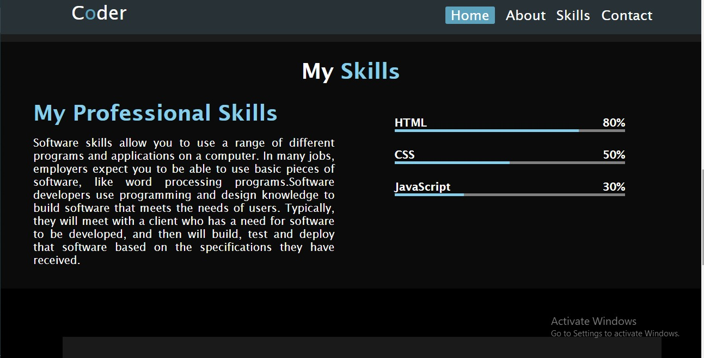
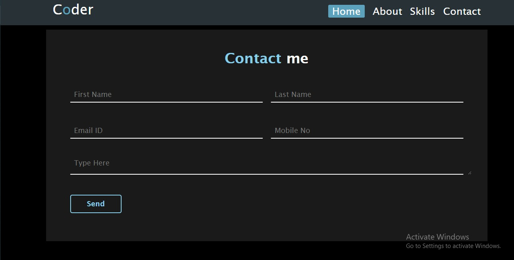
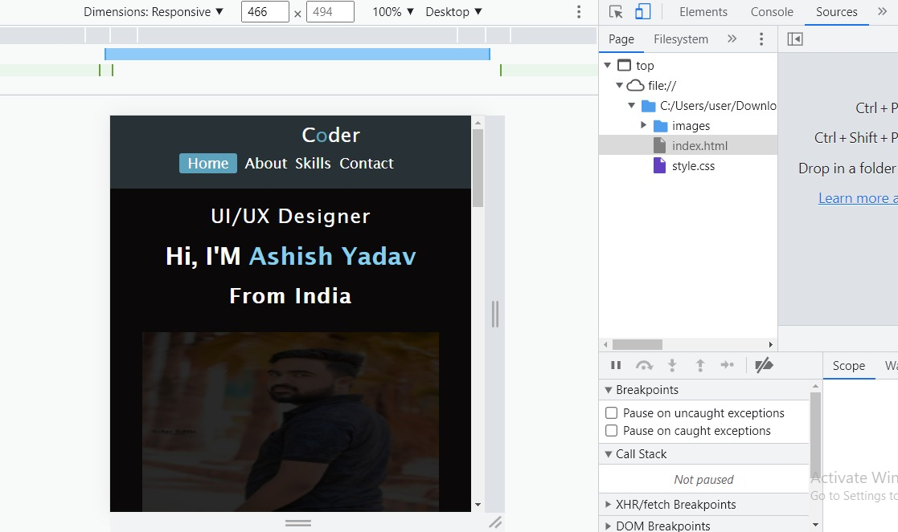

<h2 align="center"> Portfolio Website built in HTML , CSS </h2>
<h3>This portfolio project built to showcase my Technical SKills & Web Design Skills</h3>
<h1 align="center"> Technologies Used</h1>
<ul> 
<li>HTML</li>
<li>CSS</li>
</ul>

<h1 align="center"> Features are</h1>
<ul style="text-align: center;"> 
<li>Home</li>
<li>About</li>
<li>Skills</li>
<li>Contact Me</li>
</ul>

<h1 align="center"> Navbar Section</h1>
<h3>In Navbar section I created a logo which is a Coder & created a section link. Navbar position is Fixed.</h3>

<h1 align="center"> Home Section</h1>
<h3>In Home section I have used image on background, there is my name which is animated and button with hire me whenever we hover on the button , button background color would be transparent and border color would be changed.</h3>

<h1 align="center"> About Section</h1>
<h3>In about section I have told about me and there is a button download button whenever we hover on button the background color would be transparent & border would be changed. And when we click on button then CV will be downloaded. </h3>

<h1 align="center"> Skill Section</h1>
<h3>In skill section I have created two rows, in first row I told about why I like coding & second section there are skills in progressbar which I have knowledge. </h3>

<h1 align="center"> Contact Section</h1>
<h3>In contact section I created a  contact form .  </h3>

<h1 align="center">UI(User Interface)</h1>

